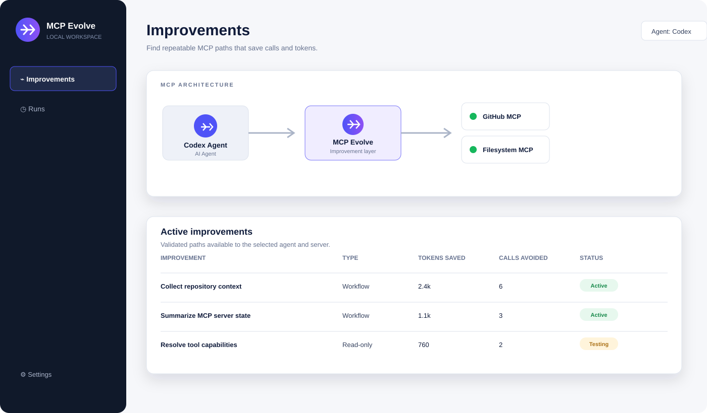
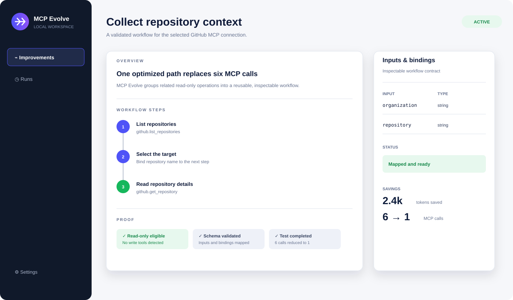

# MCP Evolve


MCP Evolve is a local Windows desktop app for making MCP usage easier to understand, improve, and operate. It connects AI agents to MCP servers through a local dashboard, shows where work can be streamlined, and keeps the MCP proxy on the user's machine.

[Download the latest Windows installer](https://github.com/thomasantonjansen/mcp-evolve/releases/latest) · [View the changelog](CHANGELOG.md) · [Report a bug](https://github.com/thomasantonjansen/mcp-evolve/issues/new/choose)

> This is the public distribution repository for MCP Evolve. It contains the product page, branding, issue templates, and release tooling only. Private application source code is intentionally not published here.

## What MCP Evolve does

- Gives AI agents a clear local view of their MCP servers and connections.
- Surfaces improvement opportunities from MCP usage traces.
- Shows raw MCP calls and optimized improvement paths side by side.
- Ships as a self-contained Windows x64 installer.
- Bundles and verifies the separately maintained [MCP Evolve Proxy](https://github.com/thomasantonjansen/mcp-workbench-proxy).

## Screenshots





## Installation

1. Download `MCP-Evolve-Setup-<version>.exe` from the [latest release](https://github.com/thomasantonjansen/mcp-evolve/releases/latest).
2. Optionally verify the download with the accompanying `SHA256SUMS.txt` file:

   ```powershell
   Get-FileHash .\MCP-Evolve-Setup-0.1.0.exe -Algorithm SHA256
   ```

3. Run the installer and follow the setup wizard.
4. Start MCP Evolve from the Start menu. The app opens its local dashboard and runs in the Windows tray.

The installer is intended for Windows 10/11 x64. Python, Node.js, npm, Git, and Go are not required on the target machine.

## Release in one command

From a clone of this repository, run:

```powershell
& .\scripts\release.ps1
```

Without `-Version`, the script scans the sibling private build folder and selects the
highest semantic version matching `MCP-Evolve-Setup-X.Y.Z.exe`. For example, if both
`0.1.0` and `0.1.1` exist, it selects `0.1.1`. Pass `-Version 0.1.0` when you want to
override automatic selection.

On Windows systems where PowerShell is forced into `ConstrainedLanguage`, do not use
`powershell.exe -File` for this script. Invoke it through the call operator instead:

```powershell
powershell.exe -NoProfile -ExecutionPolicy Bypass -Command "& 'C:\Users\gebruiker\Documents\mcp-evolve\scripts\release.ps1'"
```

The script:

1. Checks that GitHub CLI is installed and authenticated.
2. Verifies that `thomasantonjansen/mcp-evolve` is public.
3. Finds the highest-version installer at `C:\Users\gebruiker\Documents\UnityMCPApp\artifacts\MCP-Evolve-Setup-<version>.exe` when the two repositories are siblings.
4. Generates a SHA-256 checksum.
5. Creates the `v<version>` GitHub release, or updates the existing release.
6. Uploads exactly two files: the installer and `SHA256SUMS.txt`, using `--clobber` for repeatable releases.

For a different build location:

```powershell
& .\scripts\release.ps1 -Version 0.1.0 -InstallerPath 'D:\builds\MCP-Evolve-Setup-0.1.0.exe'
```

The release script never runs `git add`, `git archive`, or a source upload. It accepts one `.exe` file explicitly and passes only that file plus the checksum file to GitHub Releases.

### Prerequisites for releasing

- [GitHub CLI](https://cli.github.com/)
- An authenticated GitHub CLI session: `gh auth login`
- A finished installer matching `MCP-Evolve-Setup-<version>.exe`

The private application build remains in the separate application repository. Build the installer there first, then run the single release command from this repository.

## Related repository

The independently maintained proxy component is available in the public [MCP Evolve Proxy repository](https://github.com/thomasantonjansen/mcp-workbench-proxy). This public repository is the product page and download location for the complete MCP Evolve installer; it is not the application source repository.

## Issues and feature requests

GitHub Issues are enabled for this repository. Use the templates for [bug reports](https://github.com/thomasantonjansen/mcp-evolve/issues/new?template=bug_report.yml) and [feature requests](https://github.com/thomasantonjansen/mcp-evolve/issues/new?template=feature_request.yml). Please do not attach private logs, credentials, MCP server secrets, or private application source files.

## License and distribution

This repository is a public product and release surface. The application source code is maintained privately; publication of this repository does not grant a license to that private source code. Refer to the release notes and installer terms for the applicable distribution terms.
